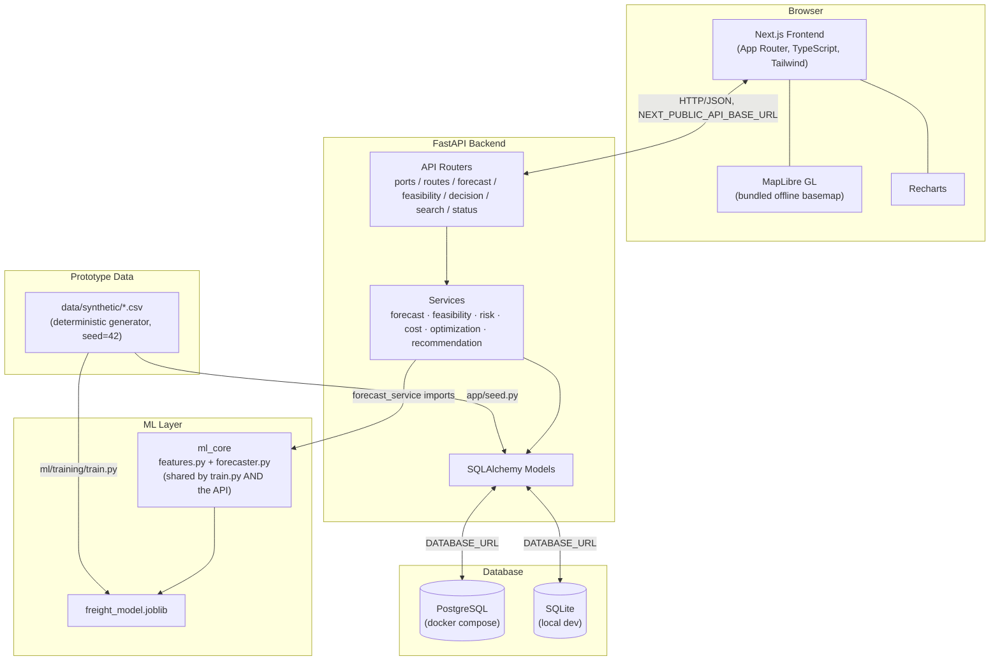
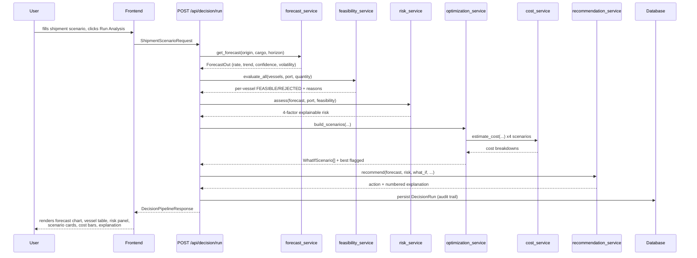
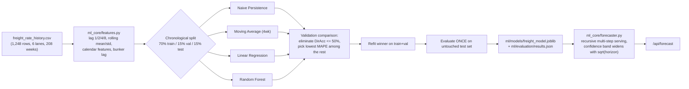
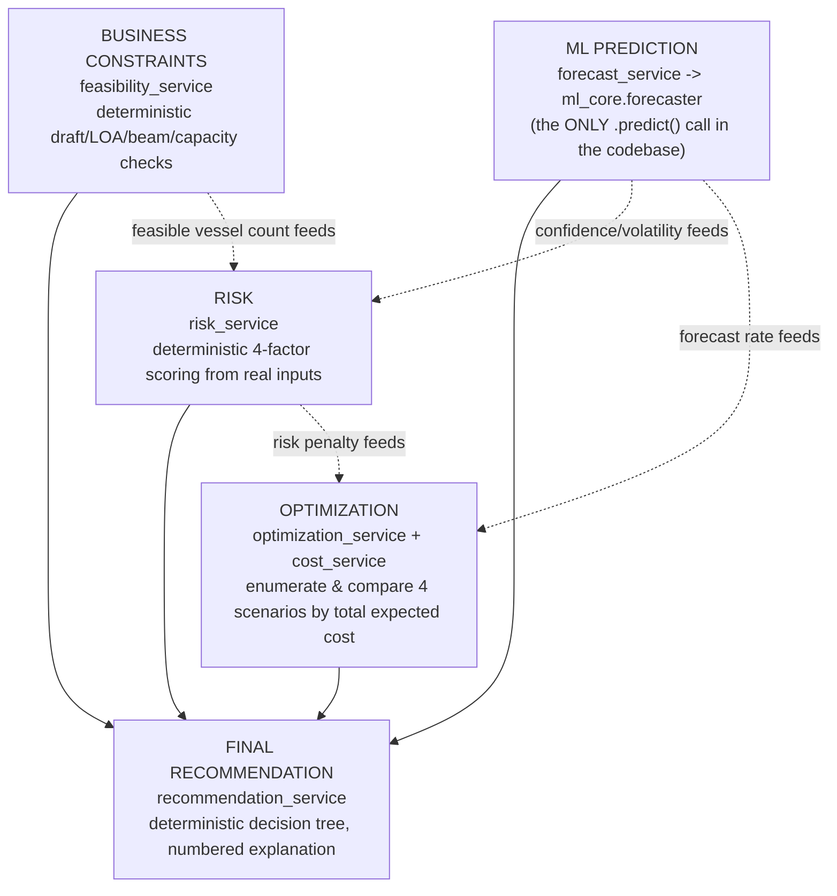
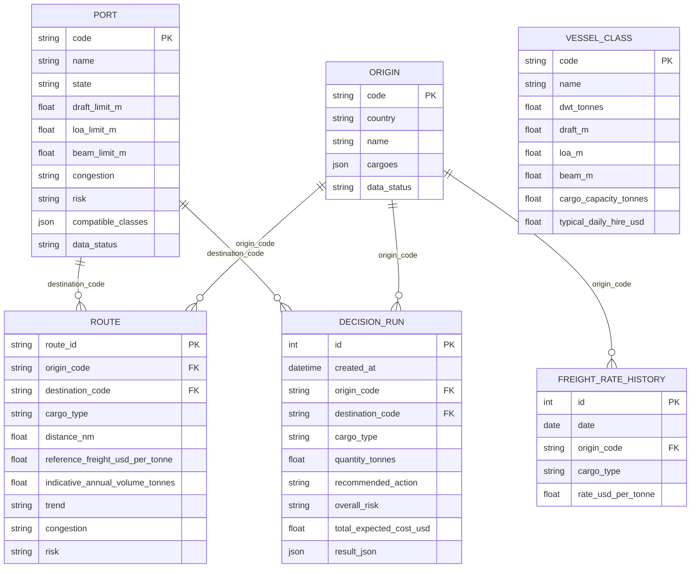
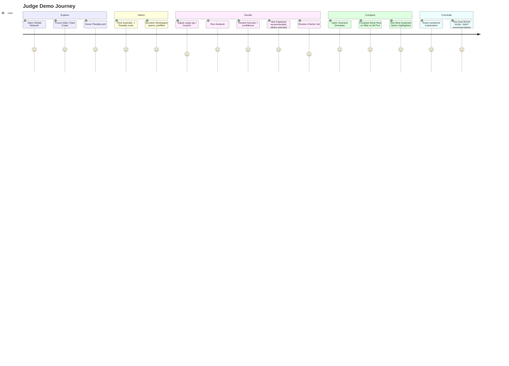
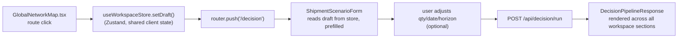

# Architecture

## 1. System Architecture

## 2. Data Flow — one Decision Workspace run

## 3. ML Pipeline

## 4. Decision Engine — AI vs Rules

## 5. Database ER Diagram

## 6. User Journey

## 7. Map → Decision Workspace Flow

## Design decision: why the Decision Workspace is one page, not four

The project brief lists `FREIGHT FORECAST`, `CHARTER OPTIMIZER`, `SCENARIO SIMULATOR`, and `RISK CENTER` as separate primary nav items, but its own **"DECISION INTELLIGENCE"** spec describes them as *Section 2 / Section 3 / Section 4* of one dashboard, run from one shipment scenario. Building four separate routes would mean either re-fetching (and re-running the ML forecast) four times per demo, or building a second piece of cross-page state synchronization on top of the one that already connects the map to the workspace — both add real engineering risk for a Sept 10 deadline with no corresponding judge-visible benefit. The Decision Workspace is implemented as **one page with a sticky section sub-nav** (`SectionNav.tsx`) so all section names from the brief are present and independently reachable, backed by exactly one pipeline call. `Risk Center` and `Port Intelligence` are also reachable as their own concepts (Risk Center is a section of the workspace; Port Intelligence is a full separate page, since it doesn't require a run shipment scenario).
